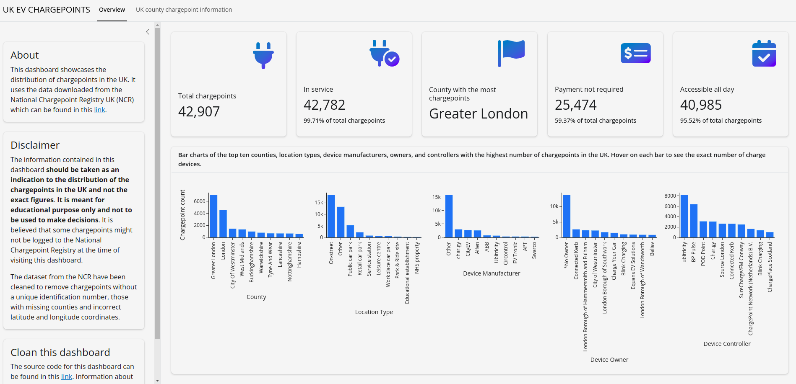

# ncr-data-dashboard
An interactive dashboard built using shiny Python library. Check out the deployed version of the app [here](https://rasheed-ibraheem.shinyapps.io/ncr-data-dashboard/).




## To run the app locally
1. Clone the repository by running
    ```
    git clone https://github.com/Rasheed19/ncr-data-dashboard.git
    ```
1. Navigate to the root folder, i.e., `ncr-data-dashboard` and create a python virtual environment by running
    ```
    python3 -m venv .venv
    source .venv/bin/activate
    ``` 
1. Prepare all modules by running
    ```
    pip install -r requirements.txt
    pip install -e .
    ```
1. Run the script `run.py` to install and clean the data used for the dashboard:
    ```
    python3 run.py
    ```
1. Run the app
   ```
    shiny run app.py
    ```
    and stop the app by  `ctrl + C`.

## Deployment
You can deploy this app to shiny cloud by following the steps highlighted [here](https://shiny.posit.co/py/docs/deploy-cloud.html). In particular, [this](https://shiny.posit.co/py/docs/deploy-cloud.html) method is used to deploy the app to shiny cloud. CI/CD via GitHub workflows is implemented for continuous integration and continuous deployment. Anythime a push is made, the workflow will test the app and if it passes, it will be deployed to shiny cloud. To use the workflow, ensure you add your `ACCOUNT`, `NAME`, `TOKEN`, and `SECRET` (all obtained from your shiny cloud account) to your repository secret. 

Alternatively, you can deploy it to Heroku by following the steps in this [link](https://github.com/analythium/shiny-load-balancing/blob/main/01-heroku.md). If you prefer this, heroku configuration file `heroku.yml` and dockerfile `Dockerfile` have been provided.
